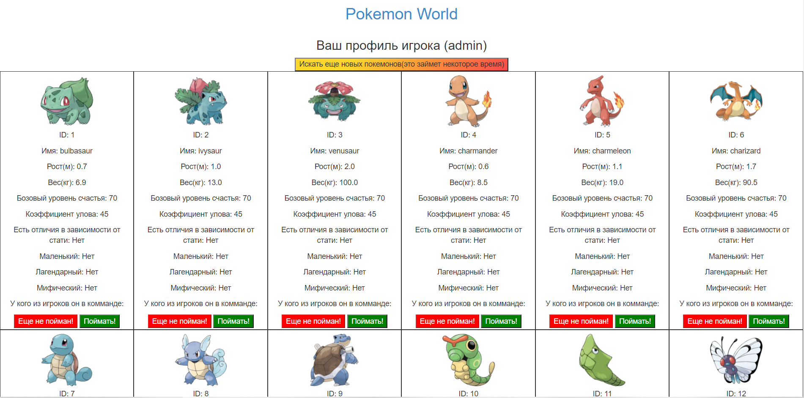
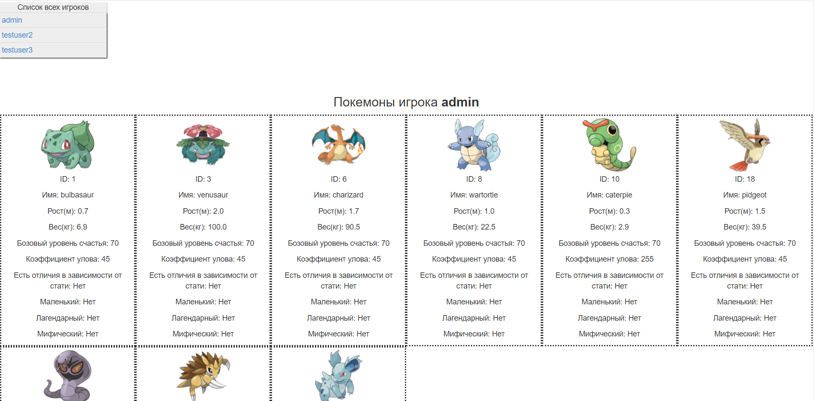
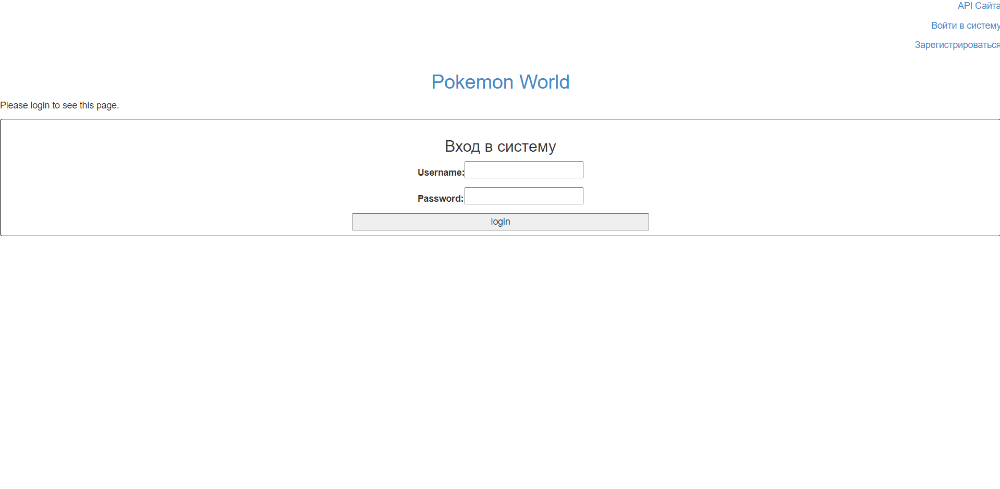
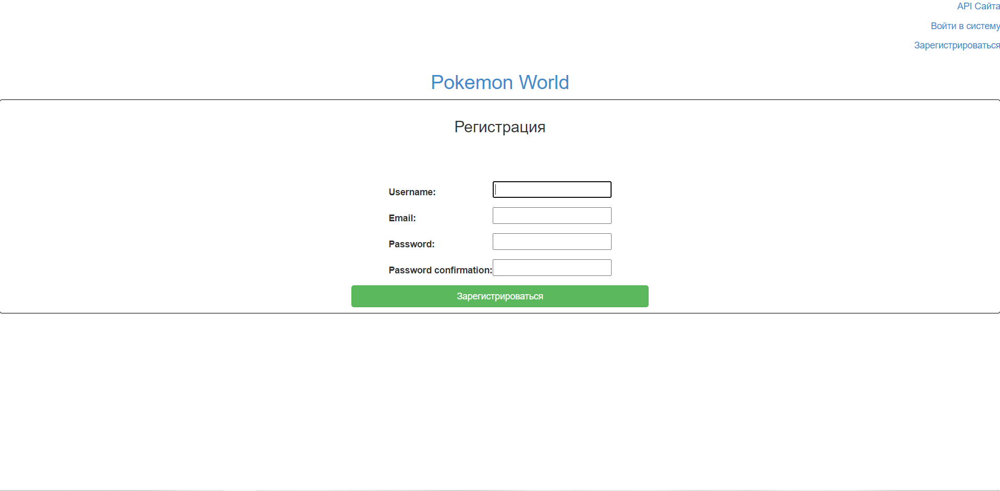

# Pokemon World Website

Сайт с использованием Django, DRF, PostgreSQL, pytest, с набором данных с помощью PokeAPI.

Есть возможность набрать себе команду из любимых персонажей и посмотреть команды других игроков, с возможностью  извлечения по API.

Также есть возможность регистрации нового аккаунта, логина и логаута.

Техногологии, которые были в необходимому стэку технологий , но которые не были использованы по причине отсутствия опыта работы с ними(а изобретать еще больше велосипедов и использовать костыли не хотелось): Docker, Mock of data

<h3>Установка</h3>

Вам понадобится:

<ul>
  <li>Python 3.6+, PostgreSQP, Django 3.x, DRF.</li>
  <li>Cкачать репозиторий(копировать) с помощью github или git - git clone https://github.com/tigerk00/Temporary-Repository-with-Test-Job.git</li>
  <li>Установить необходимые библиотеки `python -m pip install -r requirements.txt`</li>
</ul>  
<h3>Изображения приложения:</h3>

Профиль игрока с возможностью формировать команду и искать новых покемонов:

Список пользователей и их команда

Форма логина

Форма регистрации

